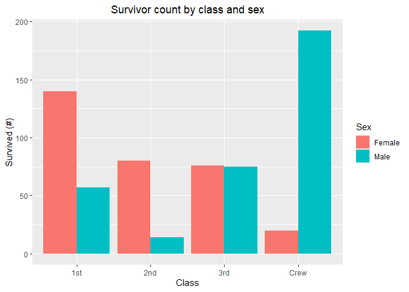
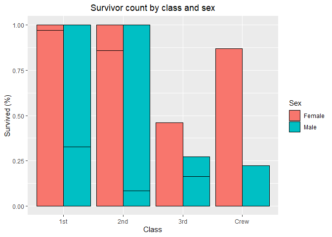
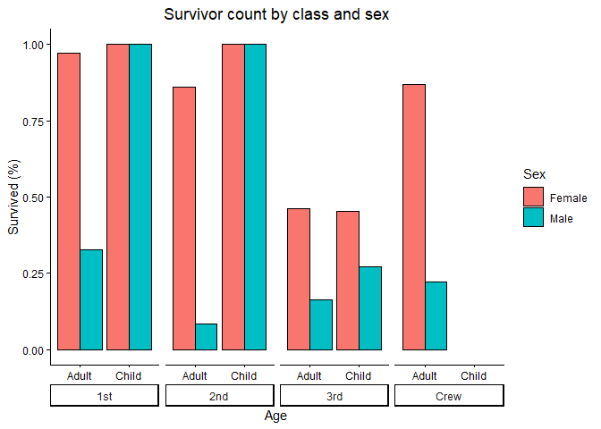

RMS Titanic
================
Jake Hamilton
2026-09-10

- [Grading Rubric](#grading-rubric)
  - [Individual](#individual)
  - [Submission](#submission)
- [First Look](#first-look)
  - [**q1** Perform a glimpse of `df_titanic`. What variables are in
    this
    dataset?](#q1-perform-a-glimpse-of-df_titanic-what-variables-are-in-this-dataset)
  - [**q2** Skim the Wikipedia article on the RMS Titanic, and look for
    a total count of souls aboard. Compare against the total computed
    below. Are there any differences? Are those differences large or
    small? What might account for those
    differences?](#q2-skim-the-wikipedia-article-on-the-rms-titanic-and-look-for-a-total-count-of-souls-aboard-compare-against-the-total-computed-below-are-there-any-differences-are-those-differences-large-or-small-what-might-account-for-those-differences)
  - [**q3** Create a plot showing the count of persons who *did*
    survive, along with aesthetics for `Class` and `Sex`. Document your
    observations
    below.](#q3-create-a-plot-showing-the-count-of-persons-who-did-survive-along-with-aesthetics-for-class-and-sex-document-your-observations-below)
- [Deeper Look](#deeper-look)
  - [**q4** Replicate your visual from q3, but display `Prop` in place
    of `n`. Document your observations, and note any new/different
    observations you make in comparison with q3. Is there anything
    *fishy* in your
    plot?](#q4-replicate-your-visual-from-q3-but-display-prop-in-place-of-n-document-your-observations-and-note-any-newdifferent-observations-you-make-in-comparison-with-q3-is-there-anything-fishy-in-your-plot)
  - [**q5** Create a plot showing the group-proportion of occupants who
    *did* survive, along with aesthetics for `Class`, `Sex`, *and*
    `Age`. Document your observations
    below.](#q5-create-a-plot-showing-the-group-proportion-of-occupants-who-did-survive-along-with-aesthetics-for-class-sex-and-age-document-your-observations-below)
- [Notes](#notes)

*Purpose*: Most datasets have at least a few variables. Part of our task
in analyzing a dataset is to understand trends as they vary across these
different variables. Unless we’re careful and thorough, we can easily
miss these patterns. In this challenge you’ll analyze a dataset with a
small number of categorical variables and try to find differences among
the groups.

*Reading*: (Optional) [Wikipedia
article](https://en.wikipedia.org/wiki/RMS_Titanic) on the RMS Titanic.

<!-- include-rubric -->

# Grading Rubric

<!-- -------------------------------------------------- -->

Unlike exercises, **challenges will be graded**. The following rubrics
define how you will be graded, both on an individual and team basis.

## Individual

<!-- ------------------------- -->

| Category | Needs Improvement | Satisfactory |
|----|----|----|
| Effort | Some task **q**’s left unattempted | All task **q**’s attempted |
| Observed | Did not document observations, or observations incorrect | Documented correct observations based on analysis |
| Supported | Some observations not clearly supported by analysis | All observations clearly supported by analysis (table, graph, etc.) |
| Assessed | Observations include claims not supported by the data, or reflect a level of certainty not warranted by the data | Observations are appropriately qualified by the quality & relevance of the data and (in)conclusiveness of the support |
| Specified | Uses the phrase “more data are necessary” without clarification | Any statement that “more data are necessary” specifies which *specific* data are needed to answer what *specific* question |
| Code Styled | Violations of the [style guide](https://style.tidyverse.org/) hinder readability | Code sufficiently close to the [style guide](https://style.tidyverse.org/) |

## Submission

<!-- ------------------------- -->

Make sure to commit both the challenge report (`report.md` file) and
supporting files (`report_files/` folder) when you are done! Then submit
a link to Canvas. **Your Challenge submission is not complete without
all files uploaded to GitHub.**

``` r
library(tidyverse)
```

    ## ── Attaching core tidyverse packages ──────────────────────── tidyverse 2.0.0 ──
    ## ✔ dplyr     1.2.1     ✔ readr     2.2.0
    ## ✔ forcats   1.0.1     ✔ stringr   1.6.0
    ## ✔ ggplot2   4.0.3     ✔ tibble    3.3.1
    ## ✔ lubridate 1.9.5     ✔ tidyr     1.3.2
    ## ✔ purrr     1.2.2     
    ## ── Conflicts ────────────────────────────────────────── tidyverse_conflicts() ──
    ## ✖ dplyr::filter() masks stats::filter()
    ## ✖ dplyr::lag()    masks stats::lag()
    ## ℹ Use the conflicted package (<http://conflicted.r-lib.org/>) to force all conflicts to become errors

``` r
df_titanic <- as_tibble(Titanic)
```

*Background*: The RMS Titanic sank on its maiden voyage in 1912; about
67% of its passengers died.

# First Look

<!-- -------------------------------------------------- -->

### **q1** Perform a glimpse of `df_titanic`. What variables are in this dataset?

``` r
## TASK: Perform a `glimpse` of df_titanic
glimpse(df_titanic)
```

    ## Rows: 32
    ## Columns: 5
    ## $ Class    <chr> "1st", "2nd", "3rd", "Crew", "1st", "2nd", "3rd", "Crew", "1s…
    ## $ Sex      <chr> "Male", "Male", "Male", "Male", "Female", "Female", "Female",…
    ## $ Age      <chr> "Child", "Child", "Child", "Child", "Child", "Child", "Child"…
    ## $ Survived <chr> "No", "No", "No", "No", "No", "No", "No", "No", "No", "No", "…
    ## $ n        <dbl> 0, 0, 35, 0, 0, 0, 17, 0, 118, 154, 387, 670, 4, 13, 89, 3, 5…

``` r
summary(df_titanic)
```

    ##        Class           Sex            Age          Survived        n         
    ##  Length   :32   Length   :32   Length   :32   Length   :32   Min.   :  0.00  
    ##  N.unique : 4   N.unique : 2   N.unique : 2   N.unique : 2   1st Qu.:  0.75  
    ##  N.blank  : 0   N.blank  : 0   N.blank  : 0   N.blank  : 0   Median : 13.50  
    ##  Min.nchar: 3   Min.nchar: 4   Min.nchar: 5   Min.nchar: 2   Mean   : 68.78  
    ##  Max.nchar: 4   Max.nchar: 6   Max.nchar: 5   Max.nchar: 3   3rd Qu.: 77.00  
    ##                                                              Max.   :670.00

**Observations**:

- Class
- Sex
- Age
- Survived (binary)
- n (total number in that category)

### **q2** Skim the [Wikipedia article](https://en.wikipedia.org/wiki/RMS_Titanic) on the RMS Titanic, and look for a total count of souls aboard. Compare against the total computed below. Are there any differences? Are those differences large or small? What might account for those differences?

``` r
## NOTE: No need to edit! We'll cover how to
## do this calculation in a later exercise.
df_titanic %>% summarize(total = sum(n))
```

    ## # A tibble: 1 × 1
    ##   total
    ##   <dbl>
    ## 1  2201

**Observations**:

- Write your observations here
- Are there any differences?
  - Wikepedia lists the total souls aboard as 2,208, while the dataset
    claims 2201. There is a difference of 7 souls.
- If yes, what might account for those differences?
  - 3rd class records were most likely poorly kept compared to 1st class
    records, which may cause conflicts in the records.
  - A baby may or may not be counted as a person by different datasets.
    Based on a quick google search infants under one year old could
    travel for free on the titanic which may mean that they don’t show
    up in tickets sales but do in historical birth and death records.
  - This might be a stretch but it is possible that two people aboard
    had the same name, and some historians may have thought it was a
    double count.

### **q3** Create a plot showing the count of persons who *did* survive, along with aesthetics for `Class` and `Sex`. Document your observations below.

*Note*: There are many ways to do this.

``` r
## TASK: Visualize counts against `Class` and `Sex`

df_titanic_filtered <- filter(df_titanic, Survived == "Yes")

df_titanic_filtered |> 
  ggplot(
    aes(
      fill = Sex, 
      y = n, 
      x = Class
    )
  )+ 
  geom_bar(
    position = "dodge",
    stat = "identity") +
  labs(
    y = "Survived (#)",
    title = "Survivor count by class and sex"
  ) +
  theme(plot.title = element_text(hjust = 0.5))
```

<!-- -->

**Observations**:

- While quite stricking, this graph shows absolute count, not percentage
  of total people aboard. If Many more women were present than men, this
  graph could be misleading.
- Purely by count, many more women survived than men overall. This
  tracks with practices of saving women and children first that were
  common during that time period.
- 3rd class class passengers had an even gender split among survivors.
- More 3rd class men survived than second class men which is surprising.
  But then again there may have been way more 3rd class men aboard so
  the percentages might tell a more complete story.

# Deeper Look

<!-- -------------------------------------------------- -->

Raw counts give us a sense of totals, but they are not as useful for
understanding differences between groups. This is because the
differences we see in counts could be due to either the relative size of
the group OR differences in outcomes for those groups. To make
comparisons between groups, we should also consider *proportions*.\[1\]

The following code computes proportions within each `Class, Sex, Age`
group.

``` r
## NOTE: No need to edit! We'll cover how to
## do this calculation in a later exercise.
df_prop <-
  df_titanic %>%
  group_by(Class, Sex, Age) %>%
  mutate(
    Total = sum(n),
    Prop = n / Total
  ) %>%
  ungroup()
df_prop
```

    ## # A tibble: 32 × 7
    ##    Class Sex    Age   Survived     n Total    Prop
    ##    <chr> <chr>  <chr> <chr>    <dbl> <dbl>   <dbl>
    ##  1 1st   Male   Child No           0     5   0    
    ##  2 2nd   Male   Child No           0    11   0    
    ##  3 3rd   Male   Child No          35    48   0.729
    ##  4 Crew  Male   Child No           0     0 NaN    
    ##  5 1st   Female Child No           0     1   0    
    ##  6 2nd   Female Child No           0    13   0    
    ##  7 3rd   Female Child No          17    31   0.548
    ##  8 Crew  Female Child No           0     0 NaN    
    ##  9 1st   Male   Adult No         118   175   0.674
    ## 10 2nd   Male   Adult No         154   168   0.917
    ## # ℹ 22 more rows

### **q4** Replicate your visual from q3, but display `Prop` in place of `n`. Document your observations, and note any new/different observations you make in comparison with q3. Is there anything *fishy* in your plot?

``` r
df_prop_filtered <- filter(df_prop, Survived == "Yes")

df_prop_filtered |> 
  ggplot(
    aes(
      fill= Sex, 
      y = Prop, 
      x = Class
    )
  )+ 
  geom_bar(
    position = "dodge",
    stat = "identity",
    color = "black"
  ) +
  labs(
    y = "Survived (%)",
    title = "Survivor count by class and sex"
  ) +
  theme(plot.title = element_text(hjust = 0.5))
```

    ## Warning: Removed 2 rows containing missing values or values outside the scale range
    ## (`geom_bar()`).

<!-- -->

**Observations**:

- Write your observations here.
- Is there anything *fishy* going on in your plot?
  - The graph shows 100% of people survive, which we know not to be true
    by looking at the raw proportion data. I think the issue has to do
    with the ages. Somehow, there are bars superimposed on top of each
    other for the different ages but they have the same color so unless
    you put an outline you can’t tell them apart.
  - If you apply the outline you can see the distinct bars on top of
    each other.

### **q5** Create a plot showing the group-proportion of occupants who *did* survive, along with aesthetics for `Class`, `Sex`, *and* `Age`. Document your observations below.

*Hint*: Don’t forget that you can use `facet_grid` to help consider
additional variables!

``` r
df_prop_filtered <- filter(df_prop, Survived == "Yes")

df_prop_filtered |> 
  ggplot(
    aes(
      fill = Sex,
      y = Prop, 
      x = Age
    )
  )+ 
  geom_bar(
    position = "dodge",
    stat = "identity",
    color = "black"
  ) +
  labs(
    y = "Survived (%)",
    title = "Survivor count by class and sex"
  ) +
  facet_wrap(~Class, 
             strip.position = "bottom",
             nrow = 1
             ) +
  theme_classic() +
  theme(strip.placement = "outside") +
  theme(plot.title = element_text(hjust = 0.5))
```

    ## Warning: Removed 2 rows containing missing values or values outside the scale range
    ## (`geom_bar()`).

<!-- -->

**Observations**:

- I experimented with having Age and Class as the x-axis and the other
  as the wrap and they are both helpful graphs but answer different
  questions. Its cool to play around with almost the same graph and see
  how different the data looks depending on which order you put it in.
  It is also a good reminder that you can help make an argument by
  having your graph lead the viewer in that direction purely with
  layout.
- If you saw something *fishy* in q4 above, use your new plot to explain
  the fishy-ness.
  - My explanation of the superimposed age columns in q4 is backed up by
    the q5 graph. Here we can see that 100% of first and second class
    *children* survived, not 100% of all first and second class people.

# Notes

<!-- -------------------------------------------------- -->

\[1\] This is basically the same idea as [Dimensional
Analysis](https://en.wikipedia.org/wiki/Dimensional_analysis); computing
proportions is akin to non-dimensionalizing a quantity.
