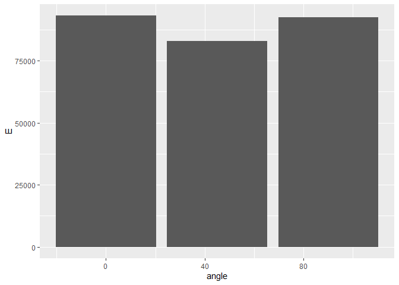
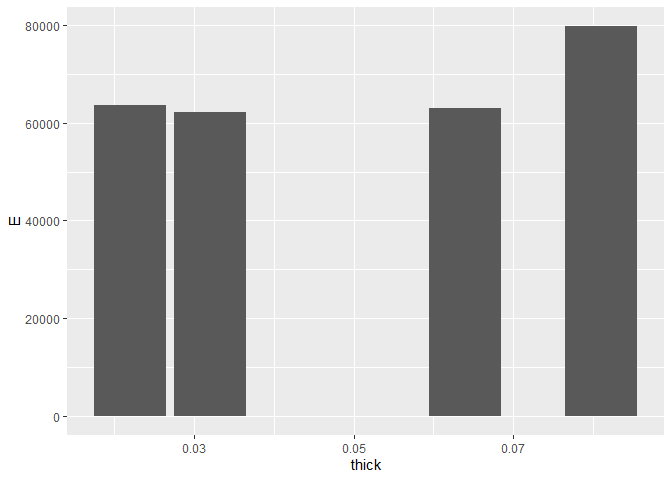
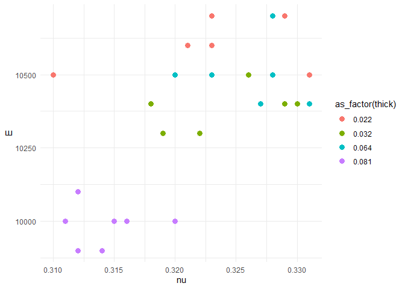

Aluminum Data
================
(Your name here)
2020-

- [Grading Rubric](#grading-rubric)
  - [Individual](#individual)
  - [Submission](#submission)
- [Loading and Wrangle](#loading-and-wrangle)
  - [**q1** Tidy `df_stang` to produce `df_stang_long`. You should have
    column names `thick, alloy, angle, E, nu`. Make sure the `angle`
    variable is of correct type. Filter out any invalid
    values.](#q1-tidy-df_stang-to-produce-df_stang_long-you-should-have-column-names-thick-alloy-angle-e-nu-make-sure-the-angle-variable-is-of-correct-type-filter-out-any-invalid-values)
- [EDA](#eda)
  - [Initial checks](#initial-checks)
    - [**q2** Perform a basic EDA on the aluminum data *without
      visualization*. Use your analysis to answer the questions under
      *observations* below. In addition, add your own *specific*
      question that you’d like to answer about the data—you’ll answer it
      below in
      q3.](#q2-perform-a-basic-eda-on-the-aluminum-data-without-visualization-use-your-analysis-to-answer-the-questions-under-observations-below-in-addition-add-your-own-specific-question-that-youd-like-to-answer-about-the-datayoull-answer-it-below-in-q3)
  - [Visualize](#visualize)
    - [**q3** Create a visualization to investigate your question from
      q2 above. Can you find an answer to your question using the
      dataset? Would you need additional information to answer your
      question?](#q3-create-a-visualization-to-investigate-your-question-from-q2-above-can-you-find-an-answer-to-your-question-using-the-dataset-would-you-need-additional-information-to-answer-your-question)
    - [**q4** Consider the following
      statement:](#q4-consider-the-following-statement)
- [References](#references)

*Purpose*: When designing structures such as bridges, boats, and planes,
the design team needs data about *material properties*. Often when we
engineers first learn about material properties through coursework, we
talk about abstract ideas and look up values in tables without ever
looking at the data that gave rise to published properties. In this
challenge you’ll study an aluminum alloy dataset: Studying these data
will give you a better sense of the challenges underlying published
material values.

In this challenge, you will load a real dataset, wrangle it into tidy
form, and perform EDA to learn more about the data.

<!-- include-rubric -->

# Grading Rubric

<!-- -------------------------------------------------- -->

Unlike exercises, **challenges will be graded**. The following rubrics
define how you will be graded, both on an individual and team basis.

## Individual

<!-- ------------------------- -->

| Category | Needs Improvement | Satisfactory |
|----|----|----|
| Effort | Some task **q**’s left unattempted | All task **q**’s attempted |
| Observed | Did not document observations, or observations incorrect | Documented correct observations based on analysis |
| Supported | Some observations not clearly supported by analysis | All observations clearly supported by analysis (table, graph, etc.) |
| Assessed | Observations include claims not supported by the data, or reflect a level of certainty not warranted by the data | Observations are appropriately qualified by the quality & relevance of the data and (in)conclusiveness of the support |
| Specified | Uses the phrase “more data are necessary” without clarification | Any statement that “more data are necessary” specifies which *specific* data are needed to answer what *specific* question |
| Code Styled | Violations of the [style guide](https://style.tidyverse.org/) hinder readability | Code sufficiently close to the [style guide](https://style.tidyverse.org/) |

## Submission

<!-- ------------------------- -->

Make sure to commit both the challenge report (`report.md` file) and
supporting files (`report_files/` folder) when you are done! Then submit
a link to Canvas. **Your Challenge submission is not complete without
all files uploaded to GitHub.**

``` r
library(tidyverse)
```

    ## ── Attaching core tidyverse packages ──────────────────────── tidyverse 2.0.0 ──
    ## ✔ dplyr     1.2.1     ✔ readr     2.2.0
    ## ✔ forcats   1.0.1     ✔ stringr   1.6.0
    ## ✔ ggplot2   4.0.3     ✔ tibble    3.3.1
    ## ✔ lubridate 1.9.5     ✔ tidyr     1.3.2
    ## ✔ purrr     1.2.2     
    ## ── Conflicts ────────────────────────────────────────── tidyverse_conflicts() ──
    ## ✖ dplyr::filter() masks stats::filter()
    ## ✖ dplyr::lag()    masks stats::lag()
    ## ℹ Use the conflicted package (<http://conflicted.r-lib.org/>) to force all conflicts to become errors

*Background*: In 1946, scientists at the Bureau of Standards tested a
number of Aluminum plates to determine their
[elasticity](https://en.wikipedia.org/wiki/Elastic_modulus) and
[Poisson’s ratio](https://en.wikipedia.org/wiki/Poisson%27s_ratio).
These are key quantities used in the design of structural members, such
as aircraft skin under [buckling
loads](https://en.wikipedia.org/wiki/Buckling). These scientists tested
plats of various thicknesses, and at different angles with respect to
the [rolling](https://en.wikipedia.org/wiki/Rolling_(metalworking))
direction.

# Loading and Wrangle

<!-- -------------------------------------------------- -->

The `readr` package in the Tidyverse contains functions to load data
form many sources. The `read_csv()` function will help us load the data
for this challenge.

``` r
## NOTE: If you extracted all challenges to the same location,
## you shouldn't have to change this filename
filename <- "./data/stang.csv"

## Load the data
df_stang <- read_csv(filename)
```

    ## Rows: 9 Columns: 8
    ## ── Column specification ────────────────────────────────────────────────────────
    ## Delimiter: ","
    ## chr (1): alloy
    ## dbl (7): thick, E_00, nu_00, E_45, nu_45, E_90, nu_90
    ## 
    ## ℹ Use `spec()` to retrieve the full column specification for this data.
    ## ℹ Specify the column types or set `show_col_types = FALSE` to quiet this message.

``` r
df_stang
```

    ## # A tibble: 9 × 8
    ##   thick  E_00 nu_00  E_45  nu_45  E_90 nu_90 alloy  
    ##   <dbl> <dbl> <dbl> <dbl>  <dbl> <dbl> <dbl> <chr>  
    ## 1 0.022 10600 0.321 10700  0.329 10500 0.31  al_24st
    ## 2 0.022 10600 0.323 10500  0.331 10700 0.323 al_24st
    ## 3 0.032 10400 0.329 10400  0.318 10300 0.322 al_24st
    ## 4 0.032 10300 0.319 10500  0.326 10400 0.33  al_24st
    ## 5 0.064 10500 0.323 10400  0.331 10400 0.327 al_24st
    ## 6 0.064 10700 0.328 10500  0.328 10500 0.32  al_24st
    ## 7 0.081 10000 0.315 10000  0.32   9900 0.314 al_24st
    ## 8 0.081 10100 0.312  9900  0.312 10000 0.316 al_24st
    ## 9 0.081 10000 0.311    -1 -1      9900 0.314 al_24st

Note that these data are not tidy! The data in this form are convenient
for reporting in a table, but are not ideal for analysis.

### **q1** Tidy `df_stang` to produce `df_stang_long`. You should have column names `thick, alloy, angle, E, nu`. Make sure the `angle` variable is of correct type. Filter out any invalid values.

*Hint*: You can reshape in one `pivot` using the `".value"` special
value for `names_to`.

``` r
## TASK: Tidy `df_stang`
df_stang_long <- df_stang |> 
  pivot_longer(
    names_to = c(".value", "angle"),
    names_sep = "_",
    cols = c(-thick, -alloy),
    values_drop_na = TRUE
  ) |> 
  mutate(angle = as.integer(angle)) |> 
  filter(E > 0)
  

df_stang_long
```

    ## # A tibble: 26 × 5
    ##    thick alloy   angle     E    nu
    ##    <dbl> <chr>   <int> <dbl> <dbl>
    ##  1 0.022 al_24st     0 10600 0.321
    ##  2 0.022 al_24st    45 10700 0.329
    ##  3 0.022 al_24st    90 10500 0.31 
    ##  4 0.022 al_24st     0 10600 0.323
    ##  5 0.022 al_24st    45 10500 0.331
    ##  6 0.022 al_24st    90 10700 0.323
    ##  7 0.032 al_24st     0 10400 0.329
    ##  8 0.032 al_24st    45 10400 0.318
    ##  9 0.032 al_24st    90 10300 0.322
    ## 10 0.032 al_24st     0 10300 0.319
    ## # ℹ 16 more rows

Use the following tests to check your work.

``` r
## NOTE: No need to change this
## Names
assertthat::assert_that(
              setequal(
                df_stang_long %>% names,
                c("thick", "alloy", "angle", "E", "nu")
              )
            )
```

    ## [1] TRUE

``` r
## Dimensions
assertthat::assert_that(all(dim(df_stang_long) == c(26, 5)))
```

    ## [1] TRUE

``` r
## Type
assertthat::assert_that(
              (df_stang_long %>% pull(angle) %>% typeof()) == "integer"
            )
```

    ## [1] TRUE

``` r
print("Very good!")
```

    ## [1] "Very good!"

# EDA

<!-- -------------------------------------------------- -->

## Initial checks

<!-- ------------------------- -->

### **q2** Perform a basic EDA on the aluminum data *without visualization*. Use your analysis to answer the questions under *observations* below. In addition, add your own *specific* question that you’d like to answer about the data—you’ll answer it below in q3.

``` r
##
df_stang_long |> 
  summary()
```

    ##      thick               alloy        angle          E               nu        
    ##  Min.   :0.02200   Length   :26   Min.   : 0   Min.   : 9900   Min.   :0.3100  
    ##  1st Qu.:0.03200   N.unique : 1   1st Qu.: 0   1st Qu.:10025   1st Qu.:0.3152  
    ##  Median :0.06400   N.blank  : 0   Median :45   Median :10400   Median :0.3215  
    ##  Mean   :0.05215   Min.nchar: 7   Mean   :45   Mean   :10335   Mean   :0.3212  
    ##  3rd Qu.:0.08100   Max.nchar: 7   3rd Qu.:90   3rd Qu.:10500   3rd Qu.:0.3277  
    ##  Max.   :0.08100                  Max.   :90   Max.   :10700   Max.   :0.3310

**Observations**:

- Is there “one true value” for the material properties of Aluminum?
  - There is not “one true value” but there is an average value of a
    bunch of values that are close together that represents an educated
    guess of a “true value”.
- How many aluminum alloys are in this dataset? How do you know?
  - 1\. The summary of the data lists N.unique as 1 for the alloy types.
- What angles were tested?
  - 0 deg, 45 deg, 90 deg.
- What thicknesses were tested?
  - 0.022 in, 0.032 in, 0.064 in, 0.081 in.
- Does elasticity vary consistently (consistently higher or consistently
  lower) with either thickness or angle?

## Visualize

<!-- ------------------------- -->

### **q3** Create a visualization to investigate your question from q2 above. Can you find an answer to your question using the dataset? Would you need additional information to answer your question?

``` r
df_stang_long |> 
  ggplot() +
  geom_col(
    aes(
      x = angle,
      y = E
    )
  )
```

<!-- -->

``` r
df_stang_long |> 
  ggplot() +
  geom_col(
    aes(
      x = thick,
      y = E
    )
  )
```

<!-- -->

**Observations**:

- Angle does not consistently affect elasticity as both 0 and 90 degree
  angles show approximately the same modulus of elasticity with no
  consistent positive or negative trend. The 45 degree angle test does
  show a noticeable drop in average elasticity but it is not enough to
  establish a consistent trend.
- Elasticity was more affected by thickness in these trials. The
  thickest trial (0.081”) showed a significantly higher modulus of
  elasticity of almost 80k compared to ~64k for 0.021”. However, the
  trend is still not consistent. Both 0.032” and 0.064” trials showed
  lower elasticity than 0.021”. So while the final trial did show a
  noticeable difference, no consistent trend was observable.

### **q4** Consider the following statement:

> “A material’s property (or material property) is an intensive property
> of some material, i.e. a physical property that does not depend on the
> amount of the material.”\[2\]

Note that the “amount of material” would vary with the thickness of a
tested plate. Does the following graph support or contradict the claim
that “elasticity `E` is an intensive material property.” Why or why not?
Is this evidence *conclusive* one way or another? Why or why not?

``` r
## NOTE: No need to change; run this chunk
df_stang_long %>%

  ggplot(aes(nu, E, color = as_factor(thick))) +
  geom_point(size = 3) +
  theme_minimal()
```

<!-- -->

**Observations**:

- Does this graph support or contradict the claim above?
  - This graph contradicts the claim above to some extent. It verifies
    the claim if we exclude the 0.081” trial. All other trials are
    somewhat randomly (probably within noise) distributed relatively
    close to each other in a clump. 0.081” however has a distinct clump
    in the bottom lefthand corner of the graph, a noticeable difference
    that in theory should not be caused by the increased thickness.
- Is this evidence *conclusive* one way or another?
  - While the 0.081” trial does show a difference from the other trial,
    we cannot determine causation. If more trials were conducted with a
    wider variety of thicknesses and an actual trend emerged, then we
    could START to draw conclusions. But given the lack of variables,
    and the lack of a trend outside of one group, 0.081” should be
    treated as an outlier with a cause that may not be shown in this
    graph.

# References

<!-- -------------------------------------------------- -->

\[1\] Stang, Greenspan, and Newman, “Poisson’s ratio of some structural
alloys for large strains” (1946) Journal of Research of the National
Bureau of Standards, (pdf
link)\[<https://nvlpubs.nist.gov/nistpubs/jres/37/jresv37n4p211_A1b.pdf>\]

\[2\] Wikipedia, *List of material properties*, accessed 2020-06-26,
(link)\[<https://en.wikipedia.org/wiki/List_of_materials_properties>\]
