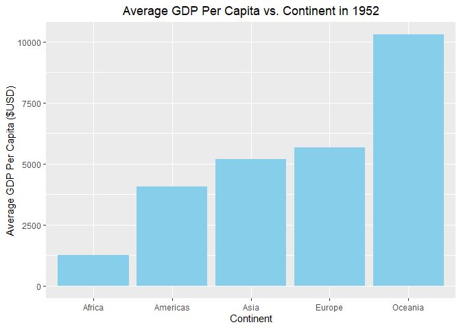
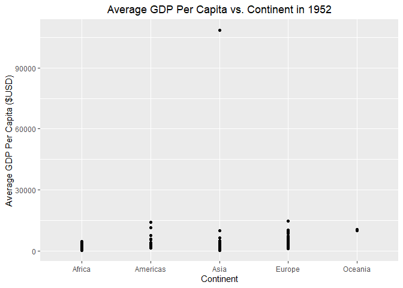
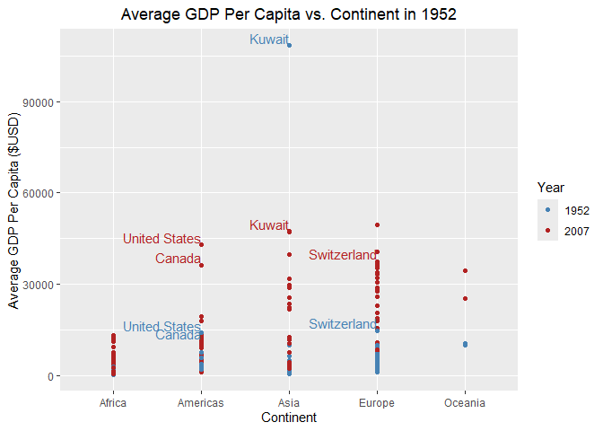
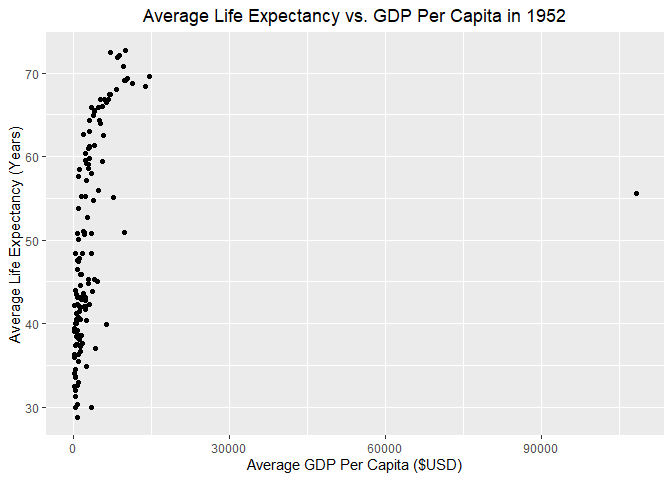
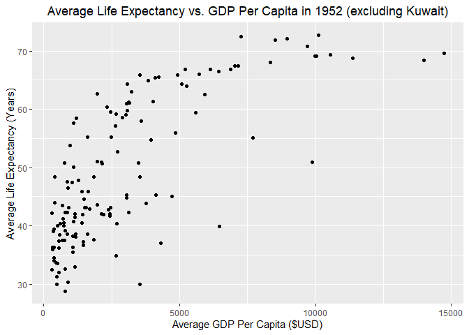
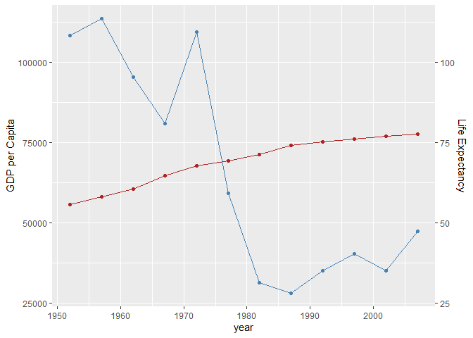
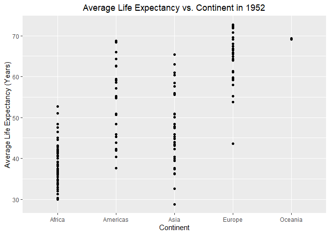
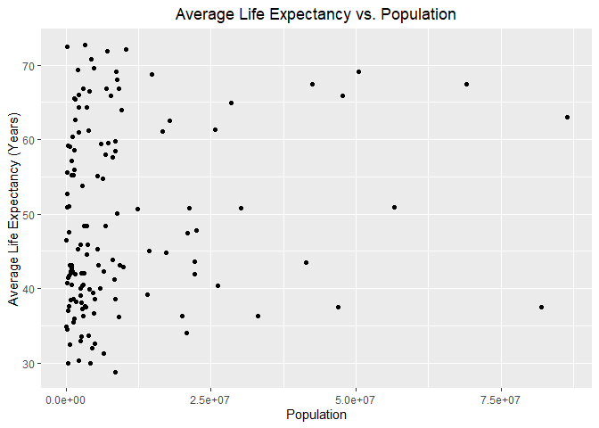

Gapminder
================
(Your name here)
2020-

- [Grading Rubric](#grading-rubric)
  - [Individual](#individual)
  - [Submission](#submission)
- [Guided EDA](#guided-eda)
  - [**q0** Perform your “first checks” on the dataset. What variables
    are in
    this](#q0-perform-your-first-checks-on-the-dataset-what-variables-are-in-this)
  - [**q1** Determine the most and least recent years in the `gapminder`
    dataset.](#q1-determine-the-most-and-least-recent-years-in-the-gapminder-dataset)
  - [**q2** Filter on years matching `year_min`, and make a plot of the
    GDP per capita against continent. Choose an appropriate `geom_` to
    visualize the data. What observations can you
    make?](#q2-filter-on-years-matching-year_min-and-make-a-plot-of-the-gdp-per-capita-against-continent-choose-an-appropriate-geom_-to-visualize-the-data-what-observations-can-you-make)
  - [**q3** You should have found *at least* three outliers in q2 (but
    possibly many more!). Identify those outliers (figure out which
    countries they
    are).](#q3-you-should-have-found-at-least-three-outliers-in-q2-but-possibly-many-more-identify-those-outliers-figure-out-which-countries-they-are)
  - [**q4** Create a plot similar to yours from q2 studying both
    `year_min` and `year_max`. Find a way to highlight the outliers from
    q3 on your plot *in a way that lets you identify which country is
    which*. Compare the patterns between `year_min` and
    `year_max`.](#q4-create-a-plot-similar-to-yours-from-q2-studying-both-year_min-and-year_max-find-a-way-to-highlight-the-outliers-from-q3-on-your-plot-in-a-way-that-lets-you-identify-which-country-is-which-compare-the-patterns-between-year_min-and-year_max)
- [Your Own EDA](#your-own-eda)
  - [**q5** Create *at least* three new figures below. With each figure,
    try to pose new questions about the
    data.](#q5-create-at-least-three-new-figures-below-with-each-figure-try-to-pose-new-questions-about-the-data)

*Purpose*: Learning to do EDA well takes practice! In this challenge
you’ll further practice EDA by first completing a guided exploration,
then by conducting your own investigation. This challenge will also give
you a chance to use the wide variety of visual tools we’ve been
learning.

<!-- include-rubric -->

# Grading Rubric

<!-- -------------------------------------------------- -->

Unlike exercises, **challenges will be graded**. The following rubrics
define how you will be graded, both on an individual and team basis.

## Individual

<!-- ------------------------- -->

| Category | Needs Improvement | Satisfactory |
|----|----|----|
| Effort | Some task **q**’s left unattempted | All task **q**’s attempted |
| Observed | Did not document observations, or observations incorrect | Documented correct observations based on analysis |
| Supported | Some observations not clearly supported by analysis | All observations clearly supported by analysis (table, graph, etc.) |
| Assessed | Observations include claims not supported by the data, or reflect a level of certainty not warranted by the data | Observations are appropriately qualified by the quality & relevance of the data and (in)conclusiveness of the support |
| Specified | Uses the phrase “more data are necessary” without clarification | Any statement that “more data are necessary” specifies which *specific* data are needed to answer what *specific* question |
| Code Styled | Violations of the [style guide](https://style.tidyverse.org/) hinder readability | Code sufficiently close to the [style guide](https://style.tidyverse.org/) |

## Submission

<!-- ------------------------- -->

Make sure to commit both the challenge report (`report.md` file) and
supporting files (`report_files/` folder) when you are done! Then submit
a link to Canvas. **Your Challenge submission is not complete without
all files uploaded to GitHub.**

``` r
library(tidyverse)
```

    ## ── Attaching core tidyverse packages ──────────────────────── tidyverse 2.0.0 ──
    ## ✔ dplyr     1.2.1     ✔ readr     2.2.0
    ## ✔ forcats   1.0.1     ✔ stringr   1.6.0
    ## ✔ ggplot2   4.0.3     ✔ tibble    3.3.1
    ## ✔ lubridate 1.9.5     ✔ tidyr     1.3.2
    ## ✔ purrr     1.2.2     
    ## ── Conflicts ────────────────────────────────────────── tidyverse_conflicts() ──
    ## ✖ dplyr::filter() masks stats::filter()
    ## ✖ dplyr::lag()    masks stats::lag()
    ## ℹ Use the conflicted package (<http://conflicted.r-lib.org/>) to force all conflicts to become errors

``` r
library(gapminder)
library(modelsummary)
```

*Background*: [Gapminder](https://www.gapminder.org/about-gapminder/) is
an independent organization that seeks to educate people about the state
of the world. They seek to counteract the worldview constructed by a
hype-driven media cycle, and promote a “fact-based worldview” by
focusing on data. The dataset we’ll study in this challenge is from
Gapminder.

# Guided EDA

<!-- -------------------------------------------------- -->

First, we’ll go through a round of *guided EDA*. Try to pay attention to
the high-level process we’re going through—after this guided round
you’ll be responsible for doing another cycle of EDA on your own!

### **q0** Perform your “first checks” on the dataset. What variables are in this

dataset?

``` r
datasummary_skim(gapminder)
```

    ## Warning: These variables were omitted because they include more than 50 levels:
    ## country.

|  | Unique | Missing Pct. | Mean | SD | Min | Median | Max | Histogram |
|----|----|----|----|----|----|----|----|----|
| year | 12 | 0 | 1979.5 | 17.3 | 1952.0 | 1979.5 | 2007.0 |  |
| lifeExp | 1626 | 0 | 59.5 | 12.9 | 23.6 | 60.7 | 82.6 |  |
| pop | 1704 | 0 | 29601212.3 | 106157896\.7 | 60011.0 | 7023595.5 | 1318683096.0 |  |
| gdpPercap | 1704 | 0 | 7215.3 | 9857.5 | 241.2 | 3531.8 | 113523.1 |  |
| continent | N | % |  |  |  |  |  |  |
| Africa | 624 | 36.6 |  |  |  |  |  |  |
| Americas | 300 | 17.6 |  |  |  |  |  |  |
| Asia | 396 | 23.2 |  |  |  |  |  |  |
| Europe | 360 | 21.1 |  |  |  |  |  |  |
| Oceania | 24 | 1.4 |  |  |  |  |  |  |

``` r
summary(gapminder)
```

    ##         country        continent        year         lifeExp     
    ##  Afghanistan:  12   Africa  :624   Min.   :1952   Min.   :23.60  
    ##  Albania    :  12   Americas:300   1st Qu.:1966   1st Qu.:48.20  
    ##  Algeria    :  12   Asia    :396   Median :1980   Median :60.71  
    ##  Angola     :  12   Europe  :360   Mean   :1980   Mean   :59.47  
    ##  Argentina  :  12   Oceania : 24   3rd Qu.:1993   3rd Qu.:70.85  
    ##  Australia  :  12                  Max.   :2007   Max.   :82.60  
    ##  (Other)    :1632                                                
    ##       pop              gdpPercap       
    ##  Min.   :6.001e+04   Min.   :   241.2  
    ##  1st Qu.:2.794e+06   1st Qu.:  1202.1  
    ##  Median :7.024e+06   Median :  3531.8  
    ##  Mean   :2.960e+07   Mean   :  7215.3  
    ##  3rd Qu.:1.959e+07   3rd Qu.:  9325.5  
    ##  Max.   :1.319e+09   Max.   :113523.1  
    ## 

``` r
gapminder
```

    ## # A tibble: 1,704 × 6
    ##    country     continent  year lifeExp      pop gdpPercap
    ##    <fct>       <fct>     <int>   <dbl>    <int>     <dbl>
    ##  1 Afghanistan Asia       1952    28.8  8425333      779.
    ##  2 Afghanistan Asia       1957    30.3  9240934      821.
    ##  3 Afghanistan Asia       1962    32.0 10267083      853.
    ##  4 Afghanistan Asia       1967    34.0 11537966      836.
    ##  5 Afghanistan Asia       1972    36.1 13079460      740.
    ##  6 Afghanistan Asia       1977    38.4 14880372      786.
    ##  7 Afghanistan Asia       1982    39.9 12881816      978.
    ##  8 Afghanistan Asia       1987    40.8 13867957      852.
    ##  9 Afghanistan Asia       1992    41.7 16317921      649.
    ## 10 Afghanistan Asia       1997    41.8 22227415      635.
    ## # ℹ 1,694 more rows

**Observations**:

- Country, continent, year, lifeExp, pop, gdpPercap

### **q1** Determine the most and least recent years in the `gapminder` dataset.

*Hint*: Use the `pull()` function to get a vector out of a tibble.
(Rather than the `$` notation of base R.)

``` r
## TASK: Find the largest and smallest values of `year` in `gapminder`
year_max <- max(gapminder["year"])
year_min <- min(gapminder["year"])
```

Use the following test to check your work.

``` r
## NOTE: No need to change this
assertthat::assert_that(year_max %% 7 == 5)
```

    ## [1] TRUE

``` r
assertthat::assert_that(year_max %% 3 == 0)
```

    ## [1] TRUE

``` r
assertthat::assert_that(year_min %% 7 == 6)
```

    ## [1] TRUE

``` r
assertthat::assert_that(year_min %% 3 == 2)
```

    ## [1] TRUE

``` r
if (is_tibble(year_max)) {
  print("year_max is a tibble; try using `pull()` to get a vector")
  assertthat::assert_that(False)
}

print("Nice!")
```

    ## [1] "Nice!"

### **q2** Filter on years matching `year_min`, and make a plot of the GDP per capita against continent. Choose an appropriate `geom_` to visualize the data. What observations can you make?

You may encounter difficulties in visualizing these data; if so document
your challenges and attempt to produce the most informative visual you
can.

``` r
## TASK: Create a visual of gdpPercap vs continent
gapminder_min_year <- gapminder |> 
  filter(year == year_min)

gapminder_min_means <- aggregate(
  gdpPercap ~ continent, 
  data = gapminder_min_year, 
  FUN = mean
  )

gapminder_min_means |> 
  ggplot() +
  geom_col(
    fill = "sky blue",
    aes(
      x = continent,
      y = gdpPercap
    )
  ) +
  labs(
    x = "Continent", 
    y = "Average GDP Per Capita ($USD)",
    title = "Average GDP Per Capita vs. Continent in 1952"
    ) +
  theme(plot.title = element_text(hjust = 0.5)) 
```

<!-- -->

``` r
gapminder_min_year |> 
  ggplot() +
  geom_point(
    aes(
      x = continent,
      y = gdpPercap
    )
  ) +
  labs(
    x = "Continent", 
    y = "Average GDP Per Capita ($USD)",
    title = "Average GDP Per Capita vs. Continent in 1952"
  ) +
  theme(plot.title = element_text(hjust = 0.5)) 
```

<!-- -->

**Observations**:

- Oceania has a drastically higher average GDP compared to Africa, ~8x.
- Americas, Asia, and Europe are really closely clustered. They are all
  within less than \$2k of each other.
- I was surprised to see North America and South America as one
  continent. I think splitting them up would tell a more interesting
  story about the gap between the two hemispheres.

**Difficulties & Approaches**:

- I really wanted to be able to average the data in the plotting
  function, but it made it way too messy and I kept getting confused so
  I had to make a separate data frame
- Getting the graph to be visually appealing was a process. I first
  started by making the color better than the stock gray, then I went on
  to adding more informative axis titles, and I finished with adding a
  title. Then I also had to figure out how to center the title. Why not
  center it by default?? weird stuff

### **q3** You should have found *at least* three outliers in q2 (but possibly many more!). Identify those outliers (figure out which countries they are).

``` r
asia_min_year_sorted <- gapminder_min_year |> 
  filter(continent == "Asia") |> 
  arrange(desc(gdpPercap))

asia_max <- asia_min_year_sorted[1,1]

asia_max
```

    ## # A tibble: 1 × 1
    ##   country
    ##   <fct>  
    ## 1 Kuwait

``` r
asia_min_year_sorted
```

    ## # A tibble: 33 × 6
    ##    country          continent  year lifeExp      pop gdpPercap
    ##    <fct>            <fct>     <int>   <dbl>    <int>     <dbl>
    ##  1 Kuwait           Asia       1952    55.6   160000   108382.
    ##  2 Bahrain          Asia       1952    50.9   120447     9867.
    ##  3 Saudi Arabia     Asia       1952    39.9  4005677     6460.
    ##  4 Lebanon          Asia       1952    55.9  1439529     4835.
    ##  5 Iraq             Asia       1952    45.3  5441766     4130.
    ##  6 Israel           Asia       1952    65.4  1620914     4087.
    ##  7 Japan            Asia       1952    63.0 86459025     3217.
    ##  8 Hong Kong, China Asia       1952    61.0  2125900     3054.
    ##  9 Iran             Asia       1952    44.9 17272000     3035.
    ## 10 Singapore        Asia       1952    60.4  1127000     2315.
    ## # ℹ 23 more rows

``` r
europe_min_year_sorted <- gapminder_min_year |> 
  filter(continent == "Europe") |> 
  arrange(desc(gdpPercap))

europe_max <- europe_min_year_sorted[1,1]

europe_max
```

    ## # A tibble: 1 × 1
    ##   country    
    ##   <fct>      
    ## 1 Switzerland

``` r
europe_min_year_sorted
```

    ## # A tibble: 30 × 6
    ##    country        continent  year lifeExp      pop gdpPercap
    ##    <fct>          <fct>     <int>   <dbl>    <int>     <dbl>
    ##  1 Switzerland    Europe     1952    69.6  4815000    14734.
    ##  2 Norway         Europe     1952    72.7  3327728    10095.
    ##  3 United Kingdom Europe     1952    69.2 50430000     9980.
    ##  4 Denmark        Europe     1952    70.8  4334000     9692.
    ##  5 Netherlands    Europe     1952    72.1 10381988     8942.
    ##  6 Sweden         Europe     1952    71.9  7124673     8528.
    ##  7 Belgium        Europe     1952    68    8730405     8343.
    ##  8 Iceland        Europe     1952    72.5   147962     7268.
    ##  9 Germany        Europe     1952    67.5 69145952     7144.
    ## 10 France         Europe     1952    67.4 42459667     7030.
    ## # ℹ 20 more rows

``` r
americas_min_year_sorted <- gapminder_min_year |> 
  filter(continent == "Americas") |> 
  arrange(desc(gdpPercap))

americas_max <- americas_min_year_sorted[1,1]

americas_max
```

    ## # A tibble: 1 × 1
    ##   country      
    ##   <fct>        
    ## 1 United States

``` r
americas_min_year_sorted
```

    ## # A tibble: 25 × 6
    ##    country       continent  year lifeExp       pop gdpPercap
    ##    <fct>         <fct>     <int>   <dbl>     <int>     <dbl>
    ##  1 United States Americas   1952    68.4 157553000    13990.
    ##  2 Canada        Americas   1952    68.8  14785584    11367.
    ##  3 Venezuela     Americas   1952    55.1   5439568     7690.
    ##  4 Argentina     Americas   1952    62.5  17876956     5911.
    ##  5 Uruguay       Americas   1952    66.1   2252965     5717.
    ##  6 Cuba          Americas   1952    59.4   6007797     5587.
    ##  7 Chile         Americas   1952    54.7   6377619     3940.
    ##  8 Peru          Americas   1952    43.9   8025700     3759.
    ##  9 Ecuador       Americas   1952    48.4   3548753     3522.
    ## 10 Mexico        Americas   1952    50.8  30144317     3478.
    ## # ℹ 15 more rows

**Observations**:

- Identify the outlier countries from q2
  - The clearest outliers I saw were: Kuwait in Asia, Switzerland in
    Europe, and Canada + US in the Americas.

*Hint*: For the next task, it’s helpful to know a ggplot trick we’ll
learn in an upcoming exercise: You can use the `data` argument inside
any `geom_*` to modify the data that will be plotted *by that geom
only*. For instance, you can use this trick to filter a set of points to
label:

``` r
## NOTE: No need to edit, use ideas from this in q4 below
gapminder %>%
  filter(year == max(year)) %>%

  ggplot(aes(continent, lifeExp)) +
  geom_boxplot() +
  geom_point(
    data = . %>% filter(country %in% c("United Kingdom", "Japan", "Zambia")),
    mapping = aes(color = country),
    size = 2
  )
```

<!-- -->

### **q4** Create a plot similar to yours from q2 studying both `year_min` and `year_max`. Find a way to highlight the outliers from q3 on your plot *in a way that lets you identify which country is which*. Compare the patterns between `year_min` and `year_max`.

*Hint*: We’ve learned a lot of different ways to show multiple
variables; think about using different aesthetics or facets.

``` r
countries_to_label <- c("Kuwait", "United States", "Switzerland", "Canada")

gapminder |>
  filter(year %in% c(year_min, year_max)) |>
  ggplot(
    aes(
      x = continent, 
      y = gdpPercap, 
      color = factor(year)
      )
    ) +
  geom_point() +
  geom_text(
    data = ~ filter(.x, country %in% countries_to_label),
    aes(label = country),
    vjust = -0.2,
    hjust = 1,
    show.legend = FALSE
  ) +
  scale_color_manual(
    name = "Year",
    values = c("1952" = "steelblue", "2007" = "firebrick")
  ) +
  labs(
    x = "Continent", 
    y = "Average GDP Per Capita ($USD)",
    title = "Average GDP Per Capita vs. Continent in 1952"
  ) +
  theme(plot.title = element_text(hjust = 0.5))
```

<!-- -->

**Observations**:

- Kuwait is the only country among the outliers that has a lower
  gdpPercap in 2007 than it did in 1952.
- Kuwait still has the highest gdpPercap in 2007 even though it fell by
  about half.
- Oceania used to have no outliers but now it does simply because there
  are so few countries.
- On average gdpPercap went up on all continents which tracks because of
  inflation and economic development.

# Your Own EDA

<!-- -------------------------------------------------- -->

Now it’s your turn! We just went through guided EDA considering the GDP
per capita at two time points. You can continue looking at outliers,
consider different years, repeat the exercise with `lifeExp`, consider
the relationship between variables, or something else entirely.

### **q5** Create *at least* three new figures below. With each figure, try to pose new questions about the data.

``` r
gapminder_min_year |> 
  ggplot() +
  geom_point(
    aes(
      x = gdpPercap,
      y = lifeExp
    )
  ) +
  labs(
    x = "Average GDP Per Capita ($USD)", 
    y = "Average Life Expectancy (Years)",
    title = "Average Life Expectancy vs. GDP Per Capita in 1952"
  ) +
  theme(plot.title = element_text(hjust = 0.5)) 
```

<!-- -->

``` r
gapminder_min_year |> 
  filter(country != "Kuwait") |> 
  ggplot() +
  geom_point(
    aes(
      x = gdpPercap,
      y = lifeExp
    )
  ) +
  labs(
    x = "Average GDP Per Capita ($USD)", 
    y = "Average Life Expectancy (Years)",
    title = "Average Life Expectancy vs. GDP Per Capita in 1952 (excluding Kuwait)"
  ) +
  theme(plot.title = element_text(hjust = 0.5)) 
```

<!-- -->

- Without eliminating the outlier of Kuwait, it is really difficult to
  see the relationships between gdpPercap and lifeExp.
- There is a wide spread but a clear positive trend between gdpPercap
  and lifeExp. Logically this makes sense given that a more resources
  lead to better healthcare, food, living conditions etc.
- While there is a positive trend, I wonder if there is a variable that
  has a stronger trend or a more clear trend with less spread.
- Also, what the heck happened in Kuwait for them to have such a high
  GDP?

``` r
coeff <- 1000  # rough ratio of GDP scale to life expectancy scale

gapminder |> 
  filter(country == "Kuwait") |>
  ggplot() +
  geom_line(
    aes(x = year, y = gdpPercap),
    color = "steelblue"
  ) + 
  geom_point(
    aes(x = year, y = gdpPercap),
    color = "steelblue"
  ) +
  geom_line(
    aes(x = year, y = lifeExp * coeff),
    color = "firebrick"
  ) + 
  geom_point(
    aes(x = year, y = lifeExp * coeff),
    color = "firebrick"
  ) +
  scale_y_continuous(
    name = "GDP per Capita",
    sec.axis = sec_axis(~ . / coeff, name = "Life Expectancy")
  )
```

<!-- -->

- Despite the large variations and overall decline from 1950 to 2007 in
  Kuwait’s GDP per capita, life expectancy is up from just over 50, to
  over 75 years.
- While on average a higher GDP is correlated with a higher life
  expectancy, it’s not a fixed rule. Also, say with Kuwait for example,
  if the stock market crashes a lot of infrastructure still exists.

``` r
arranged_by_pop <- gapminder |> 
  filter(year == year_min) |> 
  arrange(pop, descending = TRUE)
arranged_by_pop
```

    ## # A tibble: 142 × 6
    ##    country               continent  year lifeExp    pop gdpPercap
    ##    <fct>                 <fct>     <int>   <dbl>  <int>     <dbl>
    ##  1 Sao Tome and Principe Africa     1952    46.5  60011      880.
    ##  2 Djibouti              Africa     1952    34.8  63149     2670.
    ##  3 Bahrain               Asia       1952    50.9 120447     9867.
    ##  4 Iceland               Europe     1952    72.5 147962     7268.
    ##  5 Comoros               Africa     1952    40.7 153936     1103.
    ##  6 Kuwait                Asia       1952    55.6 160000   108382.
    ##  7 Equatorial Guinea     Africa     1952    34.5 216964      376.
    ##  8 Reunion               Africa     1952    52.7 257700     2719.
    ##  9 Gambia                Africa     1952    30   284320      485.
    ## 10 Swaziland             Africa     1952    41.4 290243     1148.
    ## # ℹ 132 more rows

``` r
gapminder_min_year |> 
  ggplot() +
  geom_point(
    aes(
      x = continent,
      y = lifeExp
    )
  ) +
  labs(
    x = "Continent", 
    y = "Average Life Expectancy (Years)",
    title = "Average Life Expectancy vs. Continent in 1952"
  ) +
  theme(plot.title = element_text(hjust = 0.5)) 
```

<!-- -->

``` r
gapminder_min_year |> 
  filter(!country %in% c("India", "China", "United States")) |> 
  ggplot() +
  geom_point(
    aes(
      x = pop,
      y = lifeExp
    )
  ) +
  labs(
    x = "Population", 
    y = "Average Life Expectancy (Years)",
    title = "Average Life Expectancy vs. Population"
  ) +
  theme(plot.title = element_text(hjust = 0.5)) 
```

<!-- -->

- There seems to be no strong correlation between population and life
  expectancy.
- Again, the point about the outliers I made with Kuwait earlier stands.
  Outliers can’t be discounted many times, but they make data much
  harder to process. So its good to look at data with and without an
  outlier.
